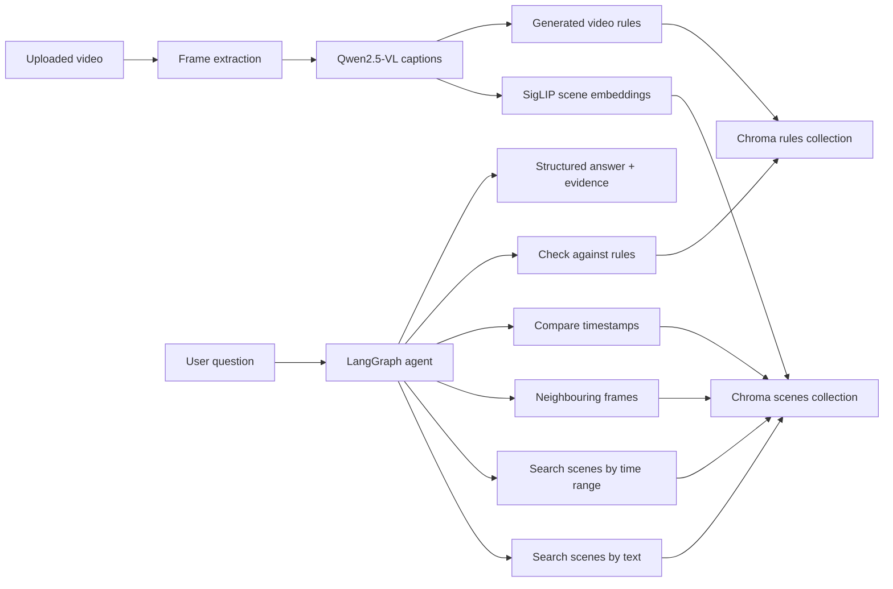
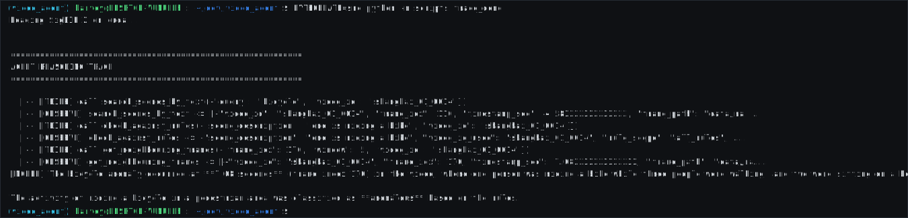

# Conversational Video Scene Agent

A multimodal AI system for surveillance-style video question answering. Upload a
video, let the system extract and caption frames, build a searchable scene
memory, generate or edit behaviour rules for that video, and ask natural-language
questions with frame-level evidence.

The main FastAPI app serves an interactive static frontend at `http://localhost:8000`.
The older Gradio demo is still available as a standalone app or mounted under
`/app` when the API server is running.

## Demo

The workflow demo starts by uploading a surveillance video, setting the frame
sampling interval, and enabling video-specific rule generation before the agent
prepares the video for question answering.

<p align="center">
  
</p>

The interface overview shows the landing page and static frontend layout.

<p align="center">
  
</p>

## What It Does

Ask questions such as:

- "Was anyone walking on the grass?"
- "What happened around 18 seconds?"
- "Was there any fighting?"
- "Which frames support the answer?"
- "Is this video normal or anomalous?"

The agent retrieves relevant frames from Chroma, checks video-specific rules,
and returns a structured answer containing classification, confidence, reasoning,
rules consulted, and timestamped evidence frames.

## Current Features

- Upload and prepare `.mp4`, `.avi`, `.mov`, or `.mkv` videos from the static UI.
- Track real preparation progress across upload, frame extraction, captioning,
  indexing, and rule generation.
- Caption sampled frames with Qwen2.5-VL.
- Embed scene memory with SigLIP 2 and store it in Chroma.
- Fine-tune SigLIP 2 with LoRA for domain-specific retrieval experiments.
- Generate rules from uploaded video content, then let users add or delete rules
  scoped to that video.
- Ask questions through a LangGraph ReAct agent with retrieval and rule-checking
  tools.
- Show retrieved evidence thumbnails and a larger selected-evidence panel.
- Serve either the FastAPI/static app on port `8000` or the Gradio demo on port
  `7860`.
- Build Docker targets for API serving and Gradio demo serving.

## Architecture



| Layer | Implementation |
| --- | --- |
| Frontend | Static HTML/CSS/JS served by FastAPI |
| API | FastAPI, with Gradio mounted at `/app` |
| Upload pipeline | OpenCV frame extraction, Qwen2.5-VL captioning, Chroma indexing |
| Captioning | `Qwen/Qwen2.5-VL-7B-Instruct` |
| Scene embedding | `google/siglip2-base-patch16-224`; LoRA adapter artifacts live in `models/siglip_lora` for experiments/evaluation |
| Rule embedding | SentenceTransformers `all-MiniLM-L6-v2` |
| Vector store | Chroma persistent collections for scenes and rules |
| Agent | LangGraph cyclic ReAct agent with five tools |
| LLM | `gpt-4o-mini` via `langchain-openai` |
| Evaluation | Pytest golden checks, DeepEval answer relevancy and faithfulness checks |

## Agent Reasoning Trace

For debugging and demos, `scripts.trace_demo` prints the agent loop as readable
tool calls and observations. This makes it easy to show how a question turns
into scene retrieval, rule checking, neighbouring-frame lookup, and a grounded
answer.



## Quick Start

### 1. Install

Use Python 3.11. `ffmpeg` is also required for video processing.

```bash
cd /path/to/video_agent

python -m venv .venv
source .venv/bin/activate

pip install -e ".[dev]"
```

Create a `.env` file with your model/API credentials:

```bash
OPENAI_API_KEY=your_openai_key
```

The captioning and embedding models are large. A CUDA-capable GPU is strongly
recommended for preparing videos.

### 2. Run the FastAPI App

```bash
make api
```

Open:

- Static app: `http://localhost:8000`
- Mounted Gradio app: `http://localhost:8000/app`
- Health check: `http://localhost:8000/health`

### 3. Run the Gradio Demo Directly

```bash
make demo
```

Open `http://localhost:7860`.

## API Examples

Start video preparation:

```bash
curl -X POST http://localhost:8000/api/prepare/start \
  -F "video_file=@/path/to/video.mp4" \
  -F "video_id=courtyard_demo" \
  -F "sample_every_n=8" \
  -F "generate_video_rules=true"
```

Poll preparation progress:

```bash
curl http://localhost:8000/api/prepare/<job_id>/progress
```

Ask a question:

```bash
curl -X POST http://localhost:8000/ask \
  -H "Content-Type: application/json" \
  -d '{
    "video_id": "courtyard_demo",
    "question": "Was anyone walking on the grass?"
  }'
```

Add rules for a prepared video:

```bash
curl -X POST http://localhost:8000/api/videos/courtyard_demo/rules \
  -H "Content-Type: application/json" \
  -d '{
    "normal_rules": ["People may walk on paved paths"],
    "abnormal_rules": ["No one should walk on the grass"]
  }'
```

List rules:

```bash
curl http://localhost:8000/api/videos/courtyard_demo/rules
```

Delete a rule:

```bash
curl -X DELETE http://localhost:8000/api/videos/courtyard_demo/rules/<rule_id>
```

## Manual Pipeline Scripts

The UI calls the full pipeline for you, but the pieces can also be run manually:

```bash
PYTHONPATH=src python -m scripts.run_extract \
  --video /path/to/video.mp4 \
  --output-dir data/uploads/courtyard_demo/frames \
  --sample-every-n 8
```

```bash
PYTHONPATH=src python -m scripts.run_caption \
  --frames-dir data/uploads/courtyard_demo/frames \
  --output-file data/uploads/courtyard_demo/captions.jsonl \
  --backend qwen2.5-vl
```

```bash
PYTHONPATH=src python -m scripts.run_ingest \
  --captions data/uploads/courtyard_demo/captions.jsonl \
  --video-id courtyard_demo \
  --fps 24
```

## SigLIP Fine-Tuning

The project includes a LoRA fine-tuning path for SigLIP 2. This is useful when
the retrieval model needs to adapt to a specific camera angle, site layout, or
surveillance vocabulary, such as distinguishing pathway walking from grass
walking or matching local anomaly descriptions more reliably.

Create frame-text training pairs:

```bash
PYTHONPATH=src python -m scripts.run_label_frames
```

Train a LoRA adapter:

```bash
PYTHONPATH=src python -m video_agent.finetune
```

Evaluate base SigLIP against the LoRA adapter:

```bash
PYTHONPATH=src python -m video_agent.evaluate_siglip
```

By default, labels are read from `data/labels/siglip_finetune.jsonl`, adapter
artifacts are written to `models/siglip_lora`, and the evaluation report is
written to `reports/siglip_lora_eval.md`. Labels, checkpoints, and model
artifacts are intentionally kept out of Git.

The API currently uses base SigLIP for scene indexing. Treat the fine-tuning path
as a measured upgrade step: train the adapter, compare retrieval metrics on a
held-out set, then wire the adapter into the ingester if it improves the target
use case.

## Docker

Build and run the FastAPI/static app:

```bash
docker build --target serve -t video-scene-agent-api .
docker run --env-file .env \
  -p 8000:8000 \
  -v "$(pwd)/data:/app/data" \
  -v "$(pwd)/chroma_db:/app/chroma_db" \
  video-scene-agent-api
```

Build and run the Gradio demo:

```bash
docker build --target demo -t video-scene-agent-demo .
docker run --env-file .env \
  -p 7860:7860 \
  -v "$(pwd)/data:/app/data" \
  -v "$(pwd)/chroma_db:/app/chroma_db" \
  video-scene-agent-demo
```

The image includes the app code and static frontend. Mount `data/` and
`chroma_db/` when you want uploaded videos, generated captions, frames, and
vector-store updates to persist outside the container. Keep large model
checkpoints outside Git and mount or download them separately when needed.

## Evaluation

Run the test suite:

```bash
make test
```

Run the evaluation script:

```bash
make eval
```

The current tests include:

- Golden classification and evidence-frame checks in `tests/test_agent_quality.py`.
- DeepEval answer relevancy and faithfulness checks in
  `tests/test_agent_deepeval.py`.

For now, the repo keeps evaluation reproducible through runnable tests rather
than quoting a benchmark number without the full evaluation run.

## Repo Structure

```text
.
|-- Dockerfile
|-- Makefile
|-- pyproject.toml
|-- static/
|   |-- index.html
|   |-- css/
|   `-- js/
|-- src/
|   |-- scripts/
|   |   |-- run_extract.py
|   |   |-- run_caption.py
|   |   `-- run_ingest.py
|   `-- video_agent/
|       |-- api.py
|       |-- ui.py
|       |-- pipeline.py
|       |-- agent.py
|       |-- tools.py
|       |-- captioner.py
|       |-- frame_extractor.py
|       |-- ingest.py
|       |-- rules.py
|       `-- schemas.py
|-- tests/
|-- models/
|-- chroma_db/
`-- data/
```

## Notes

- `data/uploads/` stores uploaded videos, extracted frames, and captions.
- `chroma_db/` stores persistent scene and rule collections.
- User-added rules are scoped by `video_id` and take priority over generated or
  global rules during anomaly checks.
- The `cogvlm` captioning option is reserved in the type hints, but the active
  captioning path currently uses Qwen2.5-VL.

## License

MIT. See `LICENSE`.
